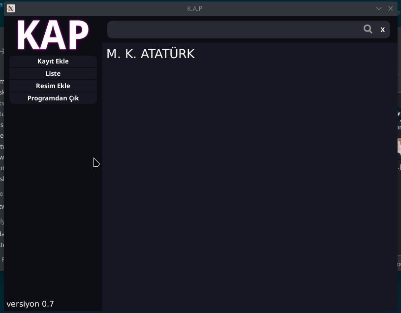

[:tr: Türkçe Oku :tr:](./READMETR.md)

# K.A.P

K.A.P (Kişi Araştırma Projesi *Turkish* - Person Research Project )

# Description

K.A.P is a contact registiration program. Carries photos in **SVG** format.

# Used Languages and Frameworks

1. Golang (webview, sqlite3, statik)
2. Javascript (jQuery, Typed.js)
3. HTML5
4. CSS3
5. SVG

# Features

1. Adding photo as SVG code
2. Adding bio
3. Adding profile photo as SVG Code
4. Writing with markdown (only [ ] for now)
5. Command input like command-line on program

# Command-line

" key (bottom of Esc) opens command-line
## Commands

`ses [on/off]` for en/disabling sounds

`sifre [pass]` for changing password

Default password = `123`

**Examples**

`ses on` turns on sounds

`sifre 123` changes password as 123

# Screenshots

## Login Screen

## Preview

## Notification

