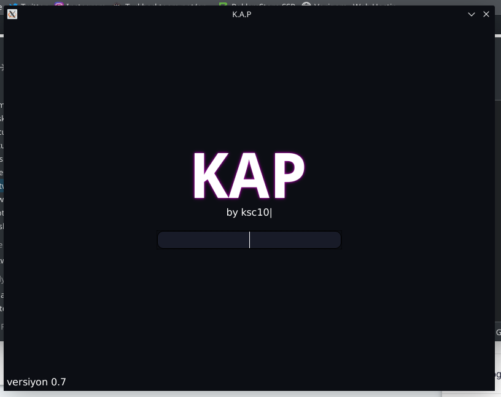
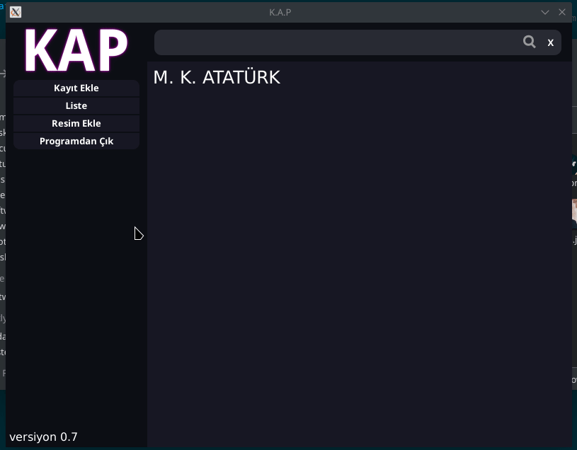

[:gb: Read English :gb:](./README.md)

# K.A.P

K.A.P (Kişi Araştırma Projesi)

# Açıklama

K.A.P, kişi kayıt programıdır. Fotoğrafları SVG kodu olarak saklar.

# Kullanılan Diller ve Kütüphaneler

1. Golang (webview, sqlite3, statik)
2. Javascript (jQuery, Typed.js)
3. HTML5
4. CSS3
5. SVG

# Özellikler

1. SVG kodu olarak fotoğraf ekleme
2. Kayıtlar için bilgi ekleme
3. SVG kodu olarak profil fotoğrafı ekleme
4. Markdown ile yazma (şuanlık sadece [ ])
5. Program üzerinde comut satırı benzeri komut girişi

# Komut Satırı

" (Esc'nin altındaki) ile komut satırını açabilirsiniz.

## Komutlar

ses [on/off] ile sesi açıp kapayabilirsiniz.

sifre [şifre] ile şifrenizi değiştirebilirsiniz.

Varsayılan şifre = 123

**Örnekler**

`ses on` sesi açar.

`sifre 123` şifreyi 123 olarak değiştirir.

# Ekran Görüntüleri

## Giriş Ekranı

## Önizleme

## Bildirim

